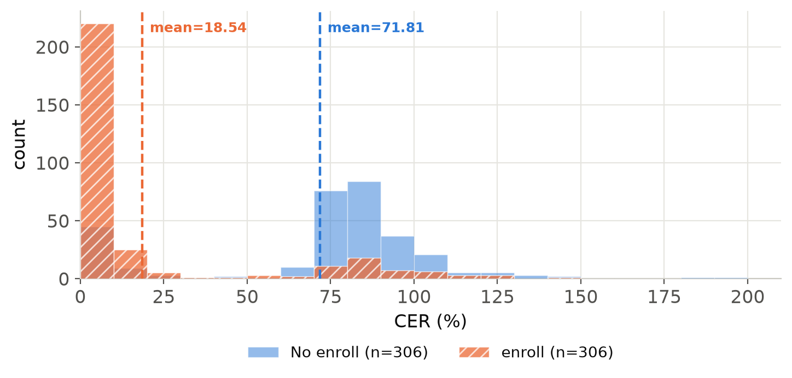
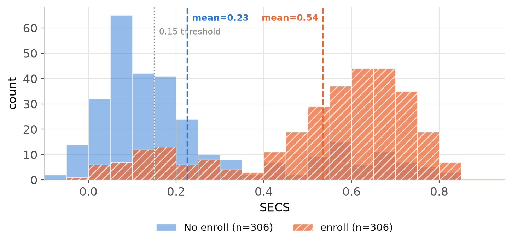
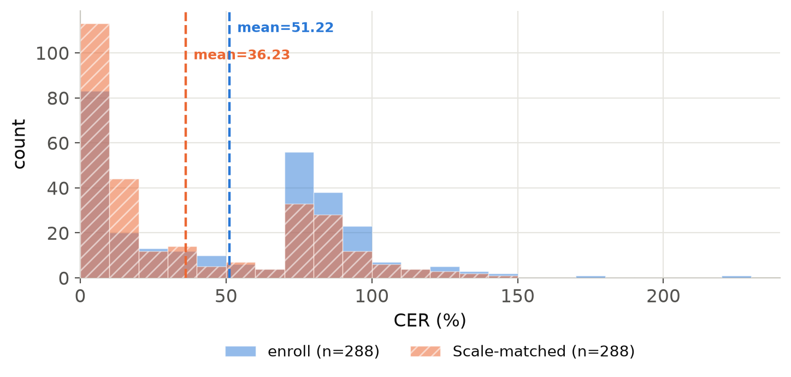
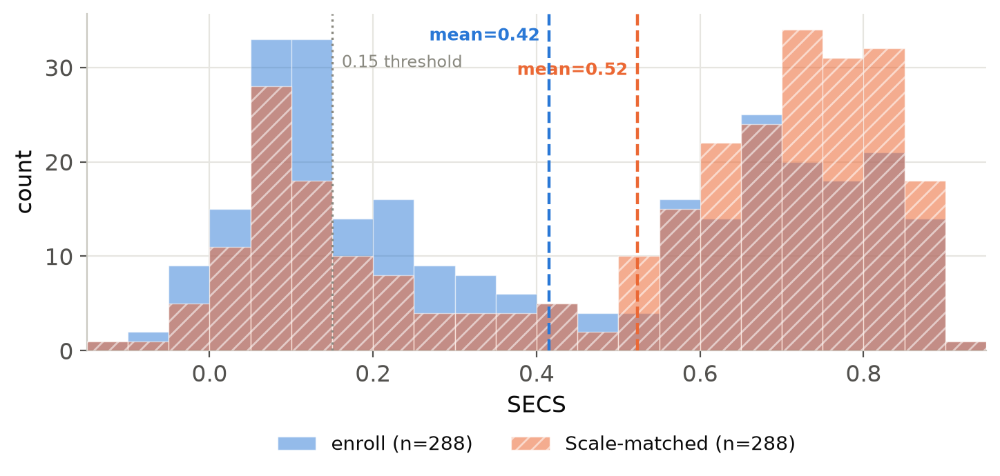
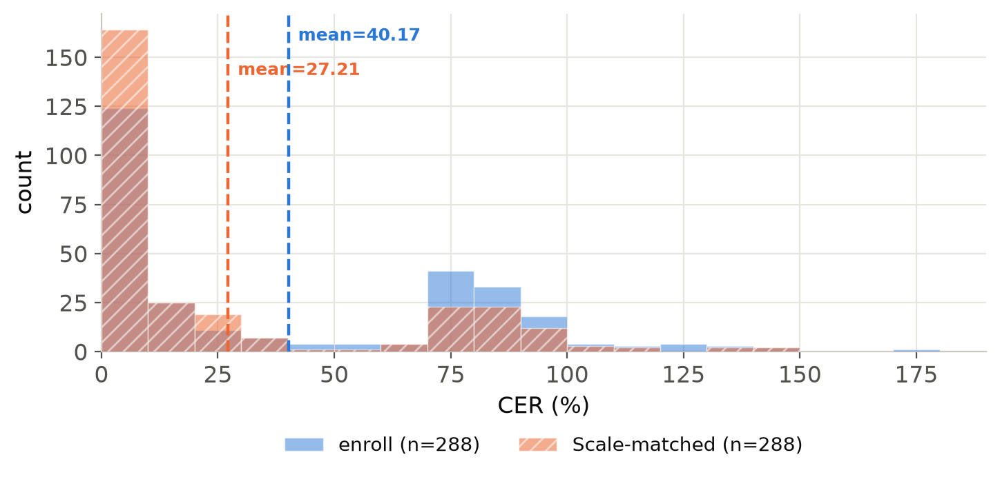
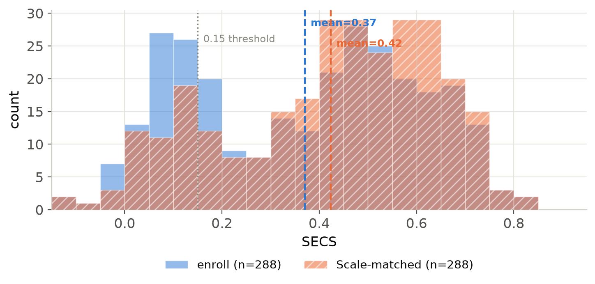

# Speech Enhancement to Target Speaker Extraction

### ICASSP 2027
<a href="2026_ICASSP.pdf" target="_blank">📄 Paper</a>

## Abstract
Speech enhancement (SE) and target speaker extraction (TSE) share the objective of recovering desired speech from corrupted input signals, but are generally trained with different data and objectives. In this work, we investigate whether pretrained SE models can perform TSE without any TSE-specific training. We find that this capability appears in WavLM-based SE models, while other evaluated SE models fail to utilize enrollment speech for target extraction. Motivated by the overlapped-speech pretraining of WavLM, we conduct a series of analyses to examine how enrollment information contributes to the transferred TSE capability. Experimental results show that the models utilize enrollment speech for target speaker selection, and that acoustic conditions of the enrollment affect extraction performance under severe interference. We further show that the downstream representation design also influences TSE performance, where information reduction effective for SE can be unfavorable for TSE. Finally, evaluation on a standard TSE benchmark demonstrates that SE-only models achieve meaningful target extraction performance compared with models explicitly trained for TSE.

<h2>Analysis</h2>

<h3>Effect of enrollment</h3>

The following histograms show how target enrollment changes the behavior of PASE
at <strong>-5 dB SIR</strong>. Without enrollment, the model often retains the
interfering speaker, leading to high CER and low speaker similarity. Providing
target enrollment shifts the CER distribution toward lower error rates and the
SECS distribution toward higher similarity, showing that PASE can use enrollment
speech for target speaker selection despite being trained only for speech enhancement.

  

    
  

  

    
  

PASE at -5 dB SIR: CER (left) and SECS (right) distributions,
comparing no enrollment and target enrollment.

<h3>Effect of enrollment scale</h3>

We next analyze the effect of <strong>scale-matched enrollment</strong>, where the
enrollment level is matched to the target speech level in the mixture. The analysis
is performed at <strong>-10 dB SIR</strong>, where the target speaker is substantially
weaker than the interferer. For both SEROM and PASE, scale matching shifts the CER
distribution toward lower error rates and the SECS distribution toward higher
target-speaker similarity, indicating that enrollment level provides an additional
cue under severe interference.

<h4>SEROM</h4>

  

    
  

  

    
  

SEROM at -10 dB SIR: CER (left) and SECS (right) distributions,
comparing standard and scale-matched enrollment.

<h4>PASE</h4>

  

    
  

  

    
  

PASE at -10 dB SIR: CER (left) and SECS (right) distributions,
comparing standard and scale-matched enrollment.

## Models
CVAE: "Towards Complex-Valued VAE-Based Distillation for Representation Learning in Speech Enhancement" in ITG, 2025  
LCT-GAN: “Study of Lightweight Transformer Architectures for Single-Channel Speech Enhancement” in EUSIPCO, 2025  
PASE: “PASE: Leveraging the Phonological Prior of WavLM for Low-Hallucination Generative Speech Enhancement” in AAAI, 2026  
SEROM: "SEROM: Speech enhancement with representation optimized SSL modeling" in IWAENC, 2026  
SEMamba++: “Universal speech enhancement with regression and generative mamba” in INTERSPEECH, 2025  
SoloSpeech: “SoloSpeech: Enhancing intelligibility and quality in target speech extraction through a cascaded generative pipeline” in IEEE TASLP, 2026  
SEF-PNet: "SEF-PNet:Speaker encoder-free personalized speech enhancement with local and global contexts aggregation" in ICASSP, 2025  

### Evaluation samples

<table style="border-collapse: collapse; text-align: center; white-space: nowrap; width: max-content;">
<tr>
<th style="min-width: 180px;">Model / Condition</th>
<th style="min-width: 155px;">1</th>
<th style="min-width: 155px;">2</th>
<th style="min-width: 155px;">3</th>
<th style="min-width: 155px;">4</th>
<th style="min-width: 155px;">5</th>
<th style="min-width: 155px;">6</th>
<th style="min-width: 155px;">7</th>
<th style="min-width: 155px;">8</th>
<th style="min-width: 155px;">9</th>
<th style="min-width: 155px;">10</th>
</tr>
<tr>
<td><strong>Input (Mixture)</strong></td>
<td><audio controls preload="none"><source src='./demo_sample/input_1.wav' type='audio/wav'></audio></td>
<td><audio controls preload="none"><source src='./demo_sample/input_2.wav' type='audio/wav'></audio></td>
<td><audio controls preload="none"><source src='./demo_sample/input_3.wav' type='audio/wav'></audio></td>
<td><audio controls preload="none"><source src='./demo_sample/input_4.wav' type='audio/wav'></audio></td>
<td><audio controls preload="none"><source src='./demo_sample/input_5.wav' type='audio/wav'></audio></td>
<td><audio controls preload="none"><source src='./demo_sample/input_6.wav' type='audio/wav'></audio></td>
<td><audio controls preload="none"><source src='./demo_sample/input_7.wav' type='audio/wav'></audio></td>
<td><audio controls preload="none"><source src='./demo_sample/input_8.wav' type='audio/wav'></audio></td>
<td><audio controls preload="none"><source src='./demo_sample/input_9.wav' type='audio/wav'></audio></td>
<td><audio controls preload="none"><source src='./demo_sample/input_10.wav' type='audio/wav'></audio></td>
</tr>
<tr>
<td><strong>Target</strong></td>
<td><audio controls preload="none"><source src='./demo_sample/target_1.wav' type='audio/wav'></audio></td>
<td><audio controls preload="none"><source src='./demo_sample/target_2.wav' type='audio/wav'></audio></td>
<td><audio controls preload="none"><source src='./demo_sample/target_3.wav' type='audio/wav'></audio></td>
<td><audio controls preload="none"><source src='./demo_sample/target_4.wav' type='audio/wav'></audio></td>
<td><audio controls preload="none"><source src='./demo_sample/target_5.wav' type='audio/wav'></audio></td>
<td><audio controls preload="none"><source src='./demo_sample/target_6.wav' type='audio/wav'></audio></td>
<td><audio controls preload="none"><source src='./demo_sample/target_7.wav' type='audio/wav'></audio></td>
<td><audio controls preload="none"><source src='./demo_sample/target_8.wav' type='audio/wav'></audio></td>
<td><audio controls preload="none"><source src='./demo_sample/target_9.wav' type='audio/wav'></audio></td>
<td><audio controls preload="none"><source src='./demo_sample/target_10.wav' type='audio/wav'></audio></td>
</tr>
<tr>
<td><strong>SEROM</strong> No enrollment</td>
<td><audio controls preload="none"><source src='./demo_sample/serom_no_enroll_1.wav' type='audio/wav'></audio></td>
<td><audio controls preload="none"><source src='./demo_sample/serom_no_enroll_2.wav' type='audio/wav'></audio></td>
<td><audio controls preload="none"><source src='./demo_sample/serom_no_enroll_3.wav' type='audio/wav'></audio></td>
<td><audio controls preload="none"><source src='./demo_sample/serom_no_enroll_4.wav' type='audio/wav'></audio></td>
<td><audio controls preload="none"><source src='./demo_sample/serom_no_enroll_5.wav' type='audio/wav'></audio></td>
<td><audio controls preload="none"><source src='./demo_sample/serom_no_enroll_6.wav' type='audio/wav'></audio></td>
<td><audio controls preload="none"><source src='./demo_sample/serom_no_enroll_7.wav' type='audio/wav'></audio></td>
<td><audio controls preload="none"><source src='./demo_sample/serom_no_enroll_8.wav' type='audio/wav'></audio></td>
<td><audio controls preload="none"><source src='./demo_sample/serom_no_enroll_9.wav' type='audio/wav'></audio></td>
<td><audio controls preload="none"><source src='./demo_sample/serom_no_enroll_10.wav' type='audio/wav'></audio></td>
</tr>
<tr>
<td>Enrollment</td>
<td><audio controls preload="none"><source src='./demo_sample/serom_enroll_1.wav' type='audio/wav'></audio></td>
<td><audio controls preload="none"><source src='./demo_sample/serom_enroll_2.wav' type='audio/wav'></audio></td>
<td><audio controls preload="none"><source src='./demo_sample/serom_enroll_3.wav' type='audio/wav'></audio></td>
<td><audio controls preload="none"><source src='./demo_sample/serom_enroll_4.wav' type='audio/wav'></audio></td>
<td><audio controls preload="none"><source src='./demo_sample/serom_enroll_5.wav' type='audio/wav'></audio></td>
<td><audio controls preload="none"><source src='./demo_sample/serom_enroll_6.wav' type='audio/wav'></audio></td>
<td><audio controls preload="none"><source src='./demo_sample/serom_enroll_7.wav' type='audio/wav'></audio></td>
<td><audio controls preload="none"><source src='./demo_sample/serom_enroll_8.wav' type='audio/wav'></audio></td>
<td><audio controls preload="none"><source src='./demo_sample/serom_enroll_9.wav' type='audio/wav'></audio></td>
<td><audio controls preload="none"><source src='./demo_sample/serom_enroll_10.wav' type='audio/wav'></audio></td>
</tr>
<tr>
<td>Scale-matched enrollment</td>
<td><audio controls preload="none"><source src='./demo_sample/serom_enroll_scale_1.wav' type='audio/wav'></audio></td>
<td><audio controls preload="none"><source src='./demo_sample/serom_enroll_scale_2.wav' type='audio/wav'></audio></td>
<td><audio controls preload="none"><source src='./demo_sample/serom_enroll_scale_3.wav' type='audio/wav'></audio></td>
<td><audio controls preload="none"><source src='./demo_sample/serom_enroll_scale_4.wav' type='audio/wav'></audio></td>
<td><audio controls preload="none"><source src='./demo_sample/serom_enroll_scale_5.wav' type='audio/wav'></audio></td>
<td><audio controls preload="none"><source src='./demo_sample/serom_enroll_scale_6.wav' type='audio/wav'></audio></td>
<td><audio controls preload="none"><source src='./demo_sample/serom_enroll_scale_7.wav' type='audio/wav'></audio></td>
<td><audio controls preload="none"><source src='./demo_sample/serom_enroll_scale_8.wav' type='audio/wav'></audio></td>
<td><audio controls preload="none"><source src='./demo_sample/serom_enroll_scale_9.wav' type='audio/wav'></audio></td>
<td><audio controls preload="none"><source src='./demo_sample/serom_enroll_scale_10.wav' type='audio/wav'></audio></td>
</tr>
<tr>
<td><strong>PASE</strong> No enrollment</td>
<td><audio controls preload="none"><source src='./demo_sample/pase_no_enroll_1.wav' type='audio/wav'></audio></td>
<td><audio controls preload="none"><source src='./demo_sample/pase_no_enroll_2.wav' type='audio/wav'></audio></td>
<td><audio controls preload="none"><source src='./demo_sample/pase_no_enroll_3.wav' type='audio/wav'></audio></td>
<td><audio controls preload="none"><source src='./demo_sample/pase_no_enroll_4.wav' type='audio/wav'></audio></td>
<td><audio controls preload="none"><source src='./demo_sample/pase_no_enroll_5.wav' type='audio/wav'></audio></td>
<td><audio controls preload="none"><source src='./demo_sample/pase_no_enroll_6.wav' type='audio/wav'></audio></td>
<td><audio controls preload="none"><source src='./demo_sample/pase_no_enroll_7.wav' type='audio/wav'></audio></td>
<td><audio controls preload="none"><source src='./demo_sample/pase_no_enroll_8.wav' type='audio/wav'></audio></td>
<td><audio controls preload="none"><source src='./demo_sample/pase_no_enroll_9.wav' type='audio/wav'></audio></td>
<td><audio controls preload="none"><source src='./demo_sample/pase_no_enroll_10.wav' type='audio/wav'></audio></td>
</tr>
<tr>
<td>Enrollment</td>
<td><audio controls preload="none"><source src='./demo_sample/pase_enroll_1.wav' type='audio/wav'></audio></td>
<td><audio controls preload="none"><source src='./demo_sample/pase_enroll_2.wav' type='audio/wav'></audio></td>
<td><audio controls preload="none"><source src='./demo_sample/pase_enroll_3.wav' type='audio/wav'></audio></td>
<td><audio controls preload="none"><source src='./demo_sample/pase_enroll_4.wav' type='audio/wav'></audio></td>
<td><audio controls preload="none"><source src='./demo_sample/pase_enroll_5.wav' type='audio/wav'></audio></td>
<td><audio controls preload="none"><source src='./demo_sample/pase_enroll_6.wav' type='audio/wav'></audio></td>
<td><audio controls preload="none"><source src='./demo_sample/pase_enroll_7.wav' type='audio/wav'></audio></td>
<td><audio controls preload="none"><source src='./demo_sample/pase_enroll_8.wav' type='audio/wav'></audio></td>
<td><audio controls preload="none"><source src='./demo_sample/pase_enroll_9.wav' type='audio/wav'></audio></td>
<td><audio controls preload="none"><source src='./demo_sample/pase_enroll_10.wav' type='audio/wav'></audio></td>
</tr>
<tr>
<td>Scale-matched enrollment</td>
<td><audio controls preload="none"><source src='./demo_sample/pase_enroll_scale_1.wav' type='audio/wav'></audio></td>
<td><audio controls preload="none"><source src='./demo_sample/pase_enroll_scale_2.wav' type='audio/wav'></audio></td>
<td><audio controls preload="none"><source src='./demo_sample/pase_enroll_scale_3.wav' type='audio/wav'></audio></td>
<td><audio controls preload="none"><source src='./demo_sample/pase_enroll_scale_4.wav' type='audio/wav'></audio></td>
<td><audio controls preload="none"><source src='./demo_sample/pase_enroll_scale_5.wav' type='audio/wav'></audio></td>
<td><audio controls preload="none"><source src='./demo_sample/pase_enroll_scale_6.wav' type='audio/wav'></audio></td>
<td><audio controls preload="none"><source src='./demo_sample/pase_enroll_scale_7.wav' type='audio/wav'></audio></td>
<td><audio controls preload="none"><source src='./demo_sample/pase_enroll_scale_8.wav' type='audio/wav'></audio></td>
<td><audio controls preload="none"><source src='./demo_sample/pase_enroll_scale_9.wav' type='audio/wav'></audio></td>
<td><audio controls preload="none"><source src='./demo_sample/pase_enroll_scale_10.wav' type='audio/wav'></audio></td>
</tr>
<tr>
<td><strong>LCT-GAN</strong> No enrollment</td>
<td><audio controls preload="none"><source src='./demo_sample/lctgan_no_enroll_1.wav' type='audio/wav'></audio></td>
<td><audio controls preload="none"><source src='./demo_sample/lctgan_no_enroll_2.wav' type='audio/wav'></audio></td>
<td><audio controls preload="none"><source src='./demo_sample/lctgan_no_enroll_3.wav' type='audio/wav'></audio></td>
<td><audio controls preload="none"><source src='./demo_sample/lctgan_no_enroll_4.wav' type='audio/wav'></audio></td>
<td><audio controls preload="none"><source src='./demo_sample/lctgan_no_enroll_5.wav' type='audio/wav'></audio></td>
<td><audio controls preload="none"><source src='./demo_sample/lctgan_no_enroll_6.wav' type='audio/wav'></audio></td>
<td><audio controls preload="none"><source src='./demo_sample/lctgan_no_enroll_7.wav' type='audio/wav'></audio></td>
<td><audio controls preload="none"><source src='./demo_sample/lctgan_no_enroll_8.wav' type='audio/wav'></audio></td>
<td><audio controls preload="none"><source src='./demo_sample/lctgan_no_enroll_9.wav' type='audio/wav'></audio></td>
<td><audio controls preload="none"><source src='./demo_sample/lctgan_no_enroll_10.wav' type='audio/wav'></audio></td>
</tr>
<tr>
<td>Enrollment</td>
<td><audio controls preload="none"><source src='./demo_sample/lctgan_enroll_1.wav' type='audio/wav'></audio></td>
<td><audio controls preload="none"><source src='./demo_sample/lctgan_enroll_2.wav' type='audio/wav'></audio></td>
<td><audio controls preload="none"><source src='./demo_sample/lctgan_enroll_3.wav' type='audio/wav'></audio></td>
<td><audio controls preload="none"><source src='./demo_sample/lctgan_enroll_4.wav' type='audio/wav'></audio></td>
<td><audio controls preload="none"><source src='./demo_sample/lctgan_enroll_5.wav' type='audio/wav'></audio></td>
<td><audio controls preload="none"><source src='./demo_sample/lctgan_enroll_6.wav' type='audio/wav'></audio></td>
<td><audio controls preload="none"><source src='./demo_sample/lctgan_enroll_7.wav' type='audio/wav'></audio></td>
<td><audio controls preload="none"><source src='./demo_sample/lctgan_enroll_8.wav' type='audio/wav'></audio></td>
<td><audio controls preload="none"><source src='./demo_sample/lctgan_enroll_9.wav' type='audio/wav'></audio></td>
<td><audio controls preload="none"><source src='./demo_sample/lctgan_enroll_10.wav' type='audio/wav'></audio></td>
</tr>
<tr>
<td>Scale-matched enrollment</td>
<td><audio controls preload="none"><source src='./demo_sample/lctgan_enroll_scale_1.wav' type='audio/wav'></audio></td>
<td><audio controls preload="none"><source src='./demo_sample/lctgan_enroll_scale_2.wav' type='audio/wav'></audio></td>
<td><audio controls preload="none"><source src='./demo_sample/lctgan_enroll_scale_3.wav' type='audio/wav'></audio></td>
<td><audio controls preload="none"><source src='./demo_sample/lctgan_enroll_scale_4.wav' type='audio/wav'></audio></td>
<td><audio controls preload="none"><source src='./demo_sample/lctgan_enroll_scale_5.wav' type='audio/wav'></audio></td>
<td><audio controls preload="none"><source src='./demo_sample/lctgan_enroll_scale_6.wav' type='audio/wav'></audio></td>
<td><audio controls preload="none"><source src='./demo_sample/lctgan_enroll_scale_7.wav' type='audio/wav'></audio></td>
<td><audio controls preload="none"><source src='./demo_sample/lctgan_enroll_scale_8.wav' type='audio/wav'></audio></td>
<td><audio controls preload="none"><source src='./demo_sample/lctgan_enroll_scale_9.wav' type='audio/wav'></audio></td>
<td><audio controls preload="none"><source src='./demo_sample/lctgan_enroll_scale_10.wav' type='audio/wav'></audio></td>
</tr>
<tr>
<td><strong>SEMamba++</strong> No enrollment</td>
<td><audio controls preload="none"><source src='./demo_sample/semembapp_no_enroll_1.wav' type='audio/wav'></audio></td>
<td><audio controls preload="none"><source src='./demo_sample/semembapp_no_enroll_2.wav' type='audio/wav'></audio></td>
<td><audio controls preload="none"><source src='./demo_sample/semembapp_no_enroll_3.wav' type='audio/wav'></audio></td>
<td><audio controls preload="none"><source src='./demo_sample/semembapp_no_enroll_4.wav' type='audio/wav'></audio></td>
<td><audio controls preload="none"><source src='./demo_sample/semembapp_no_enroll_5.wav' type='audio/wav'></audio></td>
<td><audio controls preload="none"><source src='./demo_sample/semembapp_no_enroll_6.wav' type='audio/wav'></audio></td>
<td><audio controls preload="none"><source src='./demo_sample/semembapp_no_enroll_7.wav' type='audio/wav'></audio></td>
<td><audio controls preload="none"><source src='./demo_sample/semembapp_no_enroll_8.wav' type='audio/wav'></audio></td>
<td><audio controls preload="none"><source src='./demo_sample/semembapp_no_enroll_9.wav' type='audio/wav'></audio></td>
<td><audio controls preload="none"><source src='./demo_sample/semembapp_no_enroll_10.wav' type='audio/wav'></audio></td>
</tr>
<tr>
<td>Enrollment</td>
<td><audio controls preload="none"><source src='./demo_sample/semembapp_enroll_1.wav' type='audio/wav'></audio></td>
<td><audio controls preload="none"><source src='./demo_sample/semembapp_enroll_2.wav' type='audio/wav'></audio></td>
<td><audio controls preload="none"><source src='./demo_sample/semembapp_enroll_3.wav' type='audio/wav'></audio></td>
<td><audio controls preload="none"><source src='./demo_sample/semembapp_enroll_4.wav' type='audio/wav'></audio></td>
<td><audio controls preload="none"><source src='./demo_sample/semembapp_enroll_5.wav' type='audio/wav'></audio></td>
<td><audio controls preload="none"><source src='./demo_sample/semembapp_enroll_6.wav' type='audio/wav'></audio></td>
<td><audio controls preload="none"><source src='./demo_sample/semembapp_enroll_7.wav' type='audio/wav'></audio></td>
<td><audio controls preload="none"><source src='./demo_sample/semembapp_enroll_8.wav' type='audio/wav'></audio></td>
<td><audio controls preload="none"><source src='./demo_sample/semembapp_enroll_9.wav' type='audio/wav'></audio></td>
<td><audio controls preload="none"><source src='./demo_sample/semembapp_enroll_10.wav' type='audio/wav'></audio></td>
</tr>
<tr>
<td>Scale-matched enrollment</td>
<td><audio controls preload="none"><source src='./demo_sample/semembapp_enroll_scale_1.wav' type='audio/wav'></audio></td>
<td><audio controls preload="none"><source src='./demo_sample/semembapp_enroll_scale_2.wav' type='audio/wav'></audio></td>
<td><audio controls preload="none"><source src='./demo_sample/semembapp_enroll_scale_3.wav' type='audio/wav'></audio></td>
<td><audio controls preload="none"><source src='./demo_sample/semembapp_enroll_scale_4.wav' type='audio/wav'></audio></td>
<td><audio controls preload="none"><source src='./demo_sample/semembapp_enroll_scale_5.wav' type='audio/wav'></audio></td>
<td><audio controls preload="none"><source src='./demo_sample/semembapp_enroll_scale_6.wav' type='audio/wav'></audio></td>
<td><audio controls preload="none"><source src='./demo_sample/semembapp_enroll_scale_7.wav' type='audio/wav'></audio></td>
<td><audio controls preload="none"><source src='./demo_sample/semembapp_enroll_scale_8.wav' type='audio/wav'></audio></td>
<td><audio controls preload="none"><source src='./demo_sample/semembapp_enroll_scale_9.wav' type='audio/wav'></audio></td>
<td><audio controls preload="none"><source src='./demo_sample/semembapp_enroll_scale_10.wav' type='audio/wav'></audio></td>
</tr>
<tr>
<td><strong>CVAE</strong> No enrollment</td>
<td><audio controls preload="none"><source src='./demo_sample/vae_no_enroll_1.wav' type='audio/wav'></audio></td>
<td><audio controls preload="none"><source src='./demo_sample/vae_no_enroll_2.wav' type='audio/wav'></audio></td>
<td><audio controls preload="none"><source src='./demo_sample/vae_no_enroll_3.wav' type='audio/wav'></audio></td>
<td><audio controls preload="none"><source src='./demo_sample/vae_no_enroll_4.wav' type='audio/wav'></audio></td>
<td><audio controls preload="none"><source src='./demo_sample/vae_no_enroll_5.wav' type='audio/wav'></audio></td>
<td><audio controls preload="none"><source src='./demo_sample/vae_no_enroll_6.wav' type='audio/wav'></audio></td>
<td><audio controls preload="none"><source src='./demo_sample/vae_no_enroll_7.wav' type='audio/wav'></audio></td>
<td><audio controls preload="none"><source src='./demo_sample/vae_no_enroll_8.wav' type='audio/wav'></audio></td>
<td><audio controls preload="none"><source src='./demo_sample/vae_no_enroll_9.wav' type='audio/wav'></audio></td>
<td><audio controls preload="none"><source src='./demo_sample/vae_no_enroll_10.wav' type='audio/wav'></audio></td>
</tr>
<tr>
<td>Enrollment</td>
<td><audio controls preload="none"><source src='./demo_sample/vae_enroll_1.wav' type='audio/wav'></audio></td>
<td><audio controls preload="none"><source src='./demo_sample/vae_enroll_2.wav' type='audio/wav'></audio></td>
<td><audio controls preload="none"><source src='./demo_sample/vae_enroll_3.wav' type='audio/wav'></audio></td>
<td><audio controls preload="none"><source src='./demo_sample/vae_enroll_4.wav' type='audio/wav'></audio></td>
<td><audio controls preload="none"><source src='./demo_sample/vae_enroll_5.wav' type='audio/wav'></audio></td>
<td><audio controls preload="none"><source src='./demo_sample/vae_enroll_6.wav' type='audio/wav'></audio></td>
<td><audio controls preload="none"><source src='./demo_sample/vae_enroll_7.wav' type='audio/wav'></audio></td>
<td><audio controls preload="none"><source src='./demo_sample/vae_enroll_8.wav' type='audio/wav'></audio></td>
<td><audio controls preload="none"><source src='./demo_sample/vae_enroll_9.wav' type='audio/wav'></audio></td>
<td><audio controls preload="none"><source src='./demo_sample/vae_enroll_10.wav' type='audio/wav'></audio></td>
</tr>
<tr>
<td>Scale-matched enrollment</td>
<td><audio controls preload="none"><source src='./demo_sample/vae_enroll_scale_1.wav' type='audio/wav'></audio></td>
<td><audio controls preload="none"><source src='./demo_sample/vae_enroll_scale_2.wav' type='audio/wav'></audio></td>
<td><audio controls preload="none"><source src='./demo_sample/vae_enroll_scale_3.wav' type='audio/wav'></audio></td>
<td><audio controls preload="none"><source src='./demo_sample/vae_enroll_scale_4.wav' type='audio/wav'></audio></td>
<td><audio controls preload="none"><source src='./demo_sample/vae_enroll_scale_5.wav' type='audio/wav'></audio></td>
<td><audio controls preload="none"><source src='./demo_sample/vae_enroll_scale_6.wav' type='audio/wav'></audio></td>
<td><audio controls preload="none"><source src='./demo_sample/vae_enroll_scale_7.wav' type='audio/wav'></audio></td>
<td><audio controls preload="none"><source src='./demo_sample/vae_enroll_scale_8.wav' type='audio/wav'></audio></td>
<td><audio controls preload="none"><source src='./demo_sample/vae_enroll_scale_9.wav' type='audio/wav'></audio></td>
<td><audio controls preload="none"><source src='./demo_sample/vae_enroll_scale_10.wav' type='audio/wav'></audio></td>
</tr>
</table>

### Libri2Mix samples

<table style="border-collapse: collapse; text-align: center; white-space: nowrap; width: max-content;">
<tr>
<th style="min-width: 190px;">Model</th>
<th style="min-width: 155px;">1</th>
<th style="min-width: 155px;">2</th>
<th style="min-width: 155px;">3</th>
<th style="min-width: 155px;">4</th>
<th style="min-width: 155px;">5</th>
<th style="min-width: 155px;">6</th>
<th style="min-width: 155px;">7</th>
<th style="min-width: 155px;">8</th>
<th style="min-width: 155px;">9</th>
<th style="min-width: 155px;">10</th>
</tr>
<tr>
<td><strong>Input (Mixture)</strong></td>
<td><audio controls preload="none"><source src='./demo_sample_libri2mix/input_1.wav' type='audio/wav'></audio></td>
<td><audio controls preload="none"><source src='./demo_sample_libri2mix/input_2.wav' type='audio/wav'></audio></td>
<td><audio controls preload="none"><source src='./demo_sample_libri2mix/input_3.wav' type='audio/wav'></audio></td>
<td><audio controls preload="none"><source src='./demo_sample_libri2mix/input_4.wav' type='audio/wav'></audio></td>
<td><audio controls preload="none"><source src='./demo_sample_libri2mix/input_5.wav' type='audio/wav'></audio></td>
<td><audio controls preload="none"><source src='./demo_sample_libri2mix/input_6.wav' type='audio/wav'></audio></td>
<td><audio controls preload="none"><source src='./demo_sample_libri2mix/input_7.wav' type='audio/wav'></audio></td>
<td><audio controls preload="none"><source src='./demo_sample_libri2mix/input_8.wav' type='audio/wav'></audio></td>
<td><audio controls preload="none"><source src='./demo_sample_libri2mix/input_9.wav' type='audio/wav'></audio></td>
<td><audio controls preload="none"><source src='./demo_sample_libri2mix/input_10.wav' type='audio/wav'></audio></td>
</tr>
<tr>
<td><strong>Target</strong></td>
<td><audio controls preload="none"><source src='./demo_sample_libri2mix/target_1.wav' type='audio/wav'></audio></td>
<td><audio controls preload="none"><source src='./demo_sample_libri2mix/target_2.wav' type='audio/wav'></audio></td>
<td><audio controls preload="none"><source src='./demo_sample_libri2mix/target_3.wav' type='audio/wav'></audio></td>
<td><audio controls preload="none"><source src='./demo_sample_libri2mix/target_4.wav' type='audio/wav'></audio></td>
<td><audio controls preload="none"><source src='./demo_sample_libri2mix/target_5.wav' type='audio/wav'></audio></td>
<td><audio controls preload="none"><source src='./demo_sample_libri2mix/target_6.wav' type='audio/wav'></audio></td>
<td><audio controls preload="none"><source src='./demo_sample_libri2mix/target_7.wav' type='audio/wav'></audio></td>
<td><audio controls preload="none"><source src='./demo_sample_libri2mix/target_8.wav' type='audio/wav'></audio></td>
<td><audio controls preload="none"><source src='./demo_sample_libri2mix/target_9.wav' type='audio/wav'></audio></td>
<td><audio controls preload="none"><source src='./demo_sample_libri2mix/target_10.wav' type='audio/wav'></audio></td>
</tr>
<tr>
<td><strong>SEF-PNet</strong></td>
<td><audio controls preload="none"><source src='./demo_sample_libri2mix/sefpnet_1.wav' type='audio/wav'></audio></td>
<td><audio controls preload="none"><source src='./demo_sample_libri2mix/sefpnet_2.wav' type='audio/wav'></audio></td>
<td><audio controls preload="none"><source src='./demo_sample_libri2mix/sefpnet_3.wav' type='audio/wav'></audio></td>
<td><audio controls preload="none"><source src='./demo_sample_libri2mix/sefpnet_4.wav' type='audio/wav'></audio></td>
<td><audio controls preload="none"><source src='./demo_sample_libri2mix/sefpnet_5.wav' type='audio/wav'></audio></td>
<td><audio controls preload="none"><source src='./demo_sample_libri2mix/sefpnet_6.wav' type='audio/wav'></audio></td>
<td><audio controls preload="none"><source src='./demo_sample_libri2mix/sefpnet_7.wav' type='audio/wav'></audio></td>
<td><audio controls preload="none"><source src='./demo_sample_libri2mix/sefpnet_8.wav' type='audio/wav'></audio></td>
<td><audio controls preload="none"><source src='./demo_sample_libri2mix/sefpnet_9.wav' type='audio/wav'></audio></td>
<td><audio controls preload="none"><source src='./demo_sample_libri2mix/sefpnet_10.wav' type='audio/wav'></audio></td>
</tr>
<tr>
<td><strong>SoloSpeech</strong></td>
<td><audio controls preload="none"><source src='./demo_sample_libri2mix/solospeech_1.wav' type='audio/wav'></audio></td>
<td><audio controls preload="none"><source src='./demo_sample_libri2mix/solospeech_2.wav' type='audio/wav'></audio></td>
<td><audio controls preload="none"><source src='./demo_sample_libri2mix/solospeech_3.wav' type='audio/wav'></audio></td>
<td><audio controls preload="none"><source src='./demo_sample_libri2mix/solospeech_4.wav' type='audio/wav'></audio></td>
<td><audio controls preload="none"><source src='./demo_sample_libri2mix/solospeech_5.wav' type='audio/wav'></audio></td>
<td><audio controls preload="none"><source src='./demo_sample_libri2mix/solospeech_6.wav' type='audio/wav'></audio></td>
<td><audio controls preload="none"><source src='./demo_sample_libri2mix/solospeech_7.wav' type='audio/wav'></audio></td>
<td><audio controls preload="none"><source src='./demo_sample_libri2mix/solospeech_8.wav' type='audio/wav'></audio></td>
<td><audio controls preload="none"><source src='./demo_sample_libri2mix/solospeech_9.wav' type='audio/wav'></audio></td>
<td><audio controls preload="none"><source src='./demo_sample_libri2mix/solospeech_10.wav' type='audio/wav'></audio></td>
</tr>
<tr>
<td><strong>SEROM</strong></td>
<td><audio controls preload="none"><source src='./demo_sample_libri2mix/serom_libri2mix_notrim_1.wav' type='audio/wav'></audio></td>
<td><audio controls preload="none"><source src='./demo_sample_libri2mix/serom_libri2mix_notrim_2.wav' type='audio/wav'></audio></td>
<td><audio controls preload="none"><source src='./demo_sample_libri2mix/serom_libri2mix_notrim_3.wav' type='audio/wav'></audio></td>
<td><audio controls preload="none"><source src='./demo_sample_libri2mix/serom_libri2mix_notrim_4.wav' type='audio/wav'></audio></td>
<td><audio controls preload="none"><source src='./demo_sample_libri2mix/serom_libri2mix_notrim_5.wav' type='audio/wav'></audio></td>
<td><audio controls preload="none"><source src='./demo_sample_libri2mix/serom_libri2mix_notrim_6.wav' type='audio/wav'></audio></td>
<td><audio controls preload="none"><source src='./demo_sample_libri2mix/serom_libri2mix_notrim_7.wav' type='audio/wav'></audio></td>
<td><audio controls preload="none"><source src='./demo_sample_libri2mix/serom_libri2mix_notrim_8.wav' type='audio/wav'></audio></td>
<td><audio controls preload="none"><source src='./demo_sample_libri2mix/serom_libri2mix_notrim_9.wav' type='audio/wav'></audio></td>
<td><audio controls preload="none"><source src='./demo_sample_libri2mix/serom_libri2mix_notrim_10.wav' type='audio/wav'></audio></td>
</tr>
<tr>
<td><strong>SEROM + Scale-matched</strong></td>
<td><audio controls preload="none"><source src='./demo_sample_libri2mix/serom_libri2mix_scale_notrim_1.wav' type='audio/wav'></audio></td>
<td><audio controls preload="none"><source src='./demo_sample_libri2mix/serom_libri2mix_scale_notrim_2.wav' type='audio/wav'></audio></td>
<td><audio controls preload="none"><source src='./demo_sample_libri2mix/serom_libri2mix_scale_notrim_3.wav' type='audio/wav'></audio></td>
<td><audio controls preload="none"><source src='./demo_sample_libri2mix/serom_libri2mix_scale_notrim_4.wav' type='audio/wav'></audio></td>
<td><audio controls preload="none"><source src='./demo_sample_libri2mix/serom_libri2mix_scale_notrim_5.wav' type='audio/wav'></audio></td>
<td><audio controls preload="none"><source src='./demo_sample_libri2mix/serom_libri2mix_scale_notrim_6.wav' type='audio/wav'></audio></td>
<td><audio controls preload="none"><source src='./demo_sample_libri2mix/serom_libri2mix_scale_notrim_7.wav' type='audio/wav'></audio></td>
<td><audio controls preload="none"><source src='./demo_sample_libri2mix/serom_libri2mix_scale_notrim_8.wav' type='audio/wav'></audio></td>
<td><audio controls preload="none"><source src='./demo_sample_libri2mix/serom_libri2mix_scale_notrim_9.wav' type='audio/wav'></audio></td>
<td><audio controls preload="none"><source src='./demo_sample_libri2mix/serom_libri2mix_scale_notrim_10.wav' type='audio/wav'></audio></td>
</tr>
<tr>
<td><strong>PASE</strong></td>
<td><audio controls preload="none"><source src='./demo_sample_libri2mix/pase_libri2mix_1.wav' type='audio/wav'></audio></td>
<td><audio controls preload="none"><source src='./demo_sample_libri2mix/pase_libri2mix_2.wav' type='audio/wav'></audio></td>
<td><audio controls preload="none"><source src='./demo_sample_libri2mix/pase_libri2mix_3.wav' type='audio/wav'></audio></td>
<td><audio controls preload="none"><source src='./demo_sample_libri2mix/pase_libri2mix_4.wav' type='audio/wav'></audio></td>
<td><audio controls preload="none"><source src='./demo_sample_libri2mix/pase_libri2mix_5.wav' type='audio/wav'></audio></td>
<td><audio controls preload="none"><source src='./demo_sample_libri2mix/pase_libri2mix_6.wav' type='audio/wav'></audio></td>
<td><audio controls preload="none"><source src='./demo_sample_libri2mix/pase_libri2mix_7.wav' type='audio/wav'></audio></td>
<td><audio controls preload="none"><source src='./demo_sample_libri2mix/pase_libri2mix_8.wav' type='audio/wav'></audio></td>
<td><audio controls preload="none"><source src='./demo_sample_libri2mix/pase_libri2mix_9.wav' type='audio/wav'></audio></td>
<td><audio controls preload="none"><source src='./demo_sample_libri2mix/pase_libri2mix_10.wav' type='audio/wav'></audio></td>
</tr>
<tr>
<td><strong>PASE + Scale-matched</strong></td>
<td><audio controls preload="none"><source src='./demo_sample_libri2mix/pase_libri2mix_scale_1.wav' type='audio/wav'></audio></td>
<td><audio controls preload="none"><source src='./demo_sample_libri2mix/pase_libri2mix_scale_2.wav' type='audio/wav'></audio></td>
<td><audio controls preload="none"><source src='./demo_sample_libri2mix/pase_libri2mix_scale_3.wav' type='audio/wav'></audio></td>
<td><audio controls preload="none"><source src='./demo_sample_libri2mix/pase_libri2mix_scale_4.wav' type='audio/wav'></audio></td>
<td><audio controls preload="none"><source src='./demo_sample_libri2mix/pase_libri2mix_scale_5.wav' type='audio/wav'></audio></td>
<td><audio controls preload="none"><source src='./demo_sample_libri2mix/pase_libri2mix_scale_6.wav' type='audio/wav'></audio></td>
<td><audio controls preload="none"><source src='./demo_sample_libri2mix/pase_libri2mix_scale_7.wav' type='audio/wav'></audio></td>
<td><audio controls preload="none"><source src='./demo_sample_libri2mix/pase_libri2mix_scale_8.wav' type='audio/wav'></audio></td>
<td><audio controls preload="none"><source src='./demo_sample_libri2mix/pase_libri2mix_scale_9.wav' type='audio/wav'></audio></td>
<td><audio controls preload="none"><source src='./demo_sample_libri2mix/pase_libri2mix_scale_10.wav' type='audio/wav'></audio></td>
</tr>
  <tr>
<td><strong>SEROM + Scale-matched</strong></td>
<td><audio controls preload="none"><source src='./demo_sample_libri2mix/seromi_woctc_libri2mix_scale_notrim_1.wav' type='audio/wav'></audio></td>
<td><audio controls preload="none"><source src='./demo_sample_libri2mix/seromi_woctc_libri2mix_scale_notrim_2.wav' type='audio/wav'></audio></td>
<td><audio controls preload="none"><source src='./demo_sample_libri2mix/seromi_woctc_libri2mix_scale_notrim_3.wav' type='audio/wav'></audio></td>
<td><audio controls preload="none"><source src='./demo_sample_libri2mix/seromi_woctc_libri2mix_scale_notrim_4.wav' type='audio/wav'></audio></td>
<td><audio controls preload="none"><source src='./demo_sample_libri2mix/seromi_woctc_libri2mix_scale_notrim_5.wav' type='audio/wav'></audio></td>
<td><audio controls preload="none"><source src='./demo_sample_libri2mix/seromi_woctc_libri2mix_scale_notrim_6.wav' type='audio/wav'></audio></td>
<td><audio controls preload="none"><source src='./demo_sample_libri2mix/seromi_woctc_libri2mix_scale_notrim_7.wav' type='audio/wav'></audio></td>
<td><audio controls preload="none"><source src='./demo_sample_libri2mix/seromi_woctc_libri2mix_scale_notrim_8.wav' type='audio/wav'></audio></td>
<td><audio controls preload="none"><source src='./demo_sample_libri2mix/seromi_woctc_libri2mix_scale_notrim_9.wav' type='audio/wav'></audio></td>
<td><audio controls preload="none"><source src='./demo_sample_libri2mix/seromi_woctc_libri2mix_scale_notrim_10.wav' type='audio/wav'></audio></td>
</tr>
</table>

